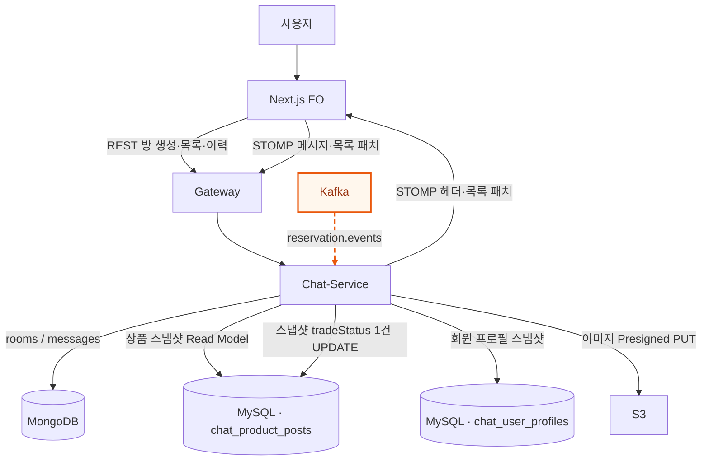

# Chat-Service

---

## 1. 한 줄 요약 · 시연

---

## 2. Tech Stack

| 구분 | 스택 |
| --- | --- |
| **Backend** | Java 17, Spring Boot, JPA, Kafka(Consumer), WebSocket/STOMP |
| **Database** | MongoDB (방·메시지), MySQL (`chat_product_posts` · `chat_user_profiles`) |
| **Infra / DevOps** | AWS S3, Docker Compose, GitHub Actions |
| **Frontend** | Next.js, TypeScript |
| **AI TOOL** | Cursor |

---

## 3. Architecture

### 채팅방 N건이 아닌 상품 스냅샷 1건으로 거래 상태 일관성을 보장하는 아키텍처

**담당:** Chat-Service — 방/메시지, 채팅 전용 상품 스냅샷(`chat_product_posts`), `reservation.events` 구독, STOMP 반영.

Product-Post와 Chat의 DB는 완전히 분리되어 있다. 거래 상태가 바뀌면 그 상품의 **모든 채팅 헤더**에 바로 보여야 하는데, 방 Document마다 상태를 넣어 동기 수정하면 쓰기 증폭이 생긴다. Chat은 방에는 `productPostUuid`만 두고, 상태는 상품 UUID 스냅샷 1건에서 읽는다.

실선은 동기 REST / STOMP / DB 쓰기다. **주황 점선은 비동기 Kafka 구독**이다.

| 단계 | Chat이 하는 일 |
| --- | --- |
| 방 생성 | Mongo에 방 INSERT. 방에는 `productPostUuid`만 둔다. 상품 이름·가격·`tradeStatus`는 `chat_product_posts`(PK=`productPostUuid`)에 스냅샷 INSERT |
| 실시간 | STOMP로 메시지 송수신. 이력·목록은 REST. 채팅 이미지는 S3 Presigned PUT |
| 구독 | `reservation.events`(`CREATED`)를 받으면 스냅샷 **1건**만 `RESERVED`로 UPDATE. 방 N개를 돌며 쓰지 않음 |
| 읽기 | 방 상세·목록 헤더는 스냅샷을 조인해 거래 상태를 보여 줌. 같은 상품의 채팅방 100개가 스냅샷 1건을 공유 |
| 부가 | 예약 말풍선은 Chat 컨슈머가 Mongo에 넣고 STOMP로 밀어 줌. 클라이언트가 `RESERVATION` 타입을 직접 보내면 거절 |

---

## 4. 기여도 및 핵심 해결 과제

고가 중고거래 플랫폼의 실시간 채팅 시스템을 설계하며, ProductPost 서비스와 Chat 서비스의 DB가 완전히 분리된 MSA 환경에서의 데이터 처리 구조를 깊이 고민했습니다.

특정 상품의 거래 상태 변경 시 모든 관련 채팅방에 상태가 즉시 반영되어야 했습니다. 만약 채팅방 Document마다 상품 상태를 비정규화해 중복 저장하고 동기식으로 수정하는 구조를 택할 경우, 인기 상품처럼 100개의 채팅방이 열려 있다면 단 1번의 상태 변경에 100회의 DB 쓰기 연산이 발생하는 1:N 쓰기 증폭(Write Amplification) 병목이 발생함을 사전에 예측했습니다. 10만 건 이상의 데이터가 누적된 상황이라면 이는 심각한 DB Lock과 I/O 지연으로 이어질 위험이 있었습니다.

이를 방지하기 위해 개발 착수 전 CQRS 패턴을 적용한 **채팅 전용 상품 스냅샷 DB(Read Model)** 를 별도 구성했습니다. 거래 상태 변경 이벤트(`reservation.events`)가 발생하면 Chat 측의 단일 스냅샷(`chat_product_posts`)만 갱신하도록 설계하여, 수백 회의 쓰기 연산을 단 1회의 업데이트로 수렴시켰습니다.

이를 통해 **100개 채팅방 기준 DB 쓰기 부하를 99% 절감(1/100 수준으로 축소)** 하는 구조적 안정성을 사전 확보했습니다.
